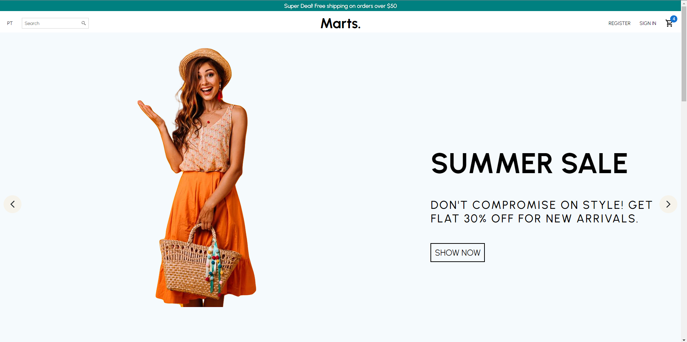
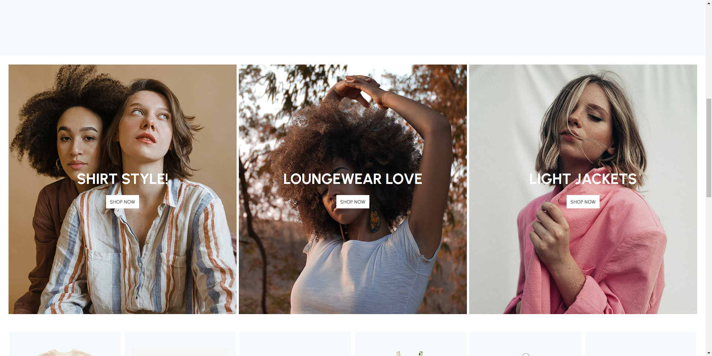
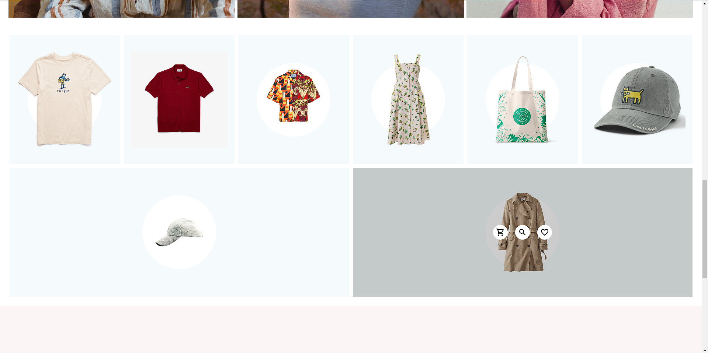
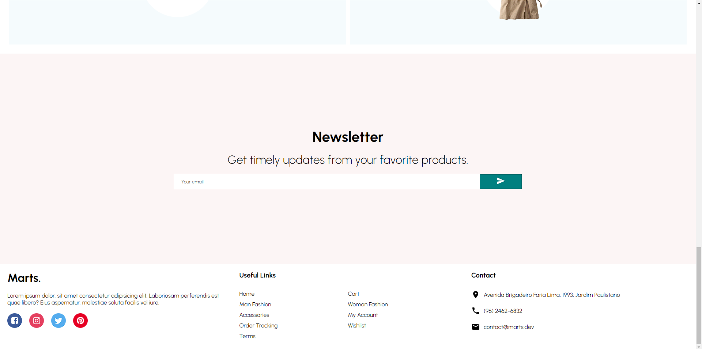
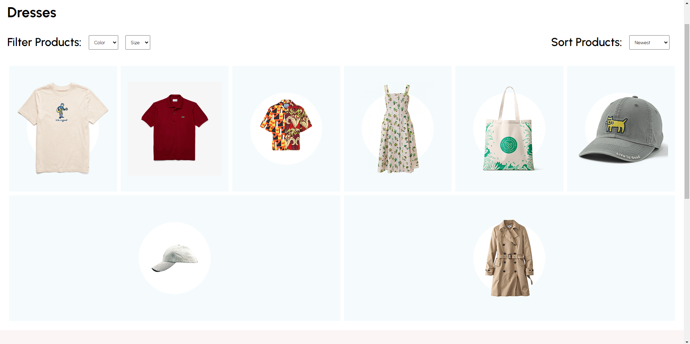
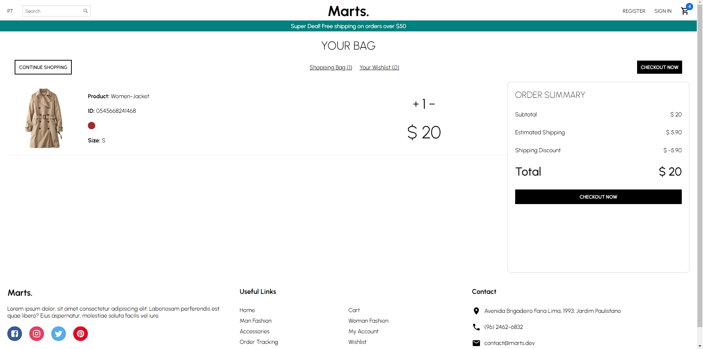
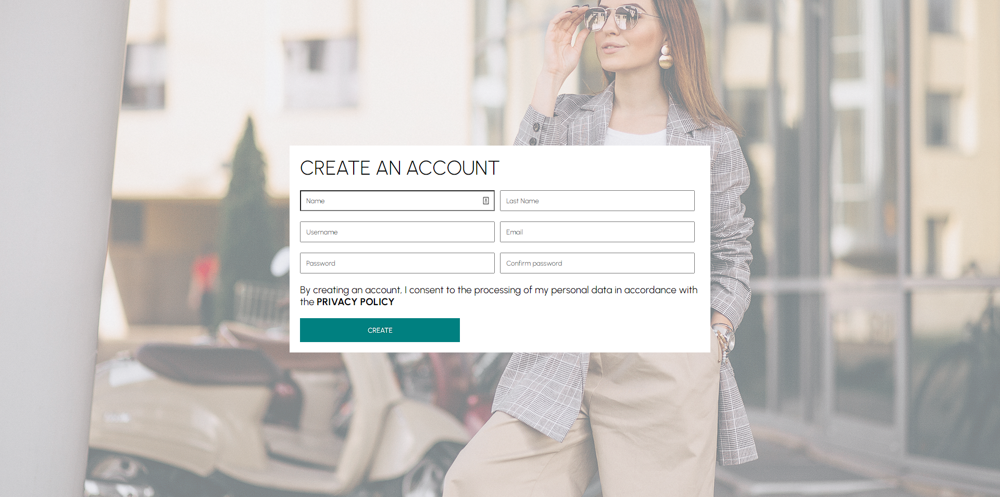
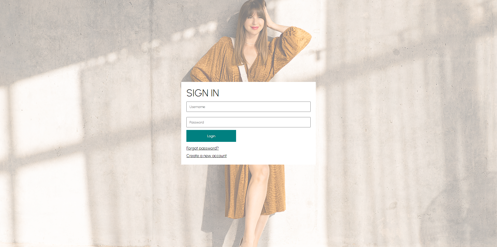

# Wellcome to React E-Commerce App client repository!▶️
 

 

## About the project 📄
 

An E-Commerce App developed using React and Styled Componnents. 
<!-- <b>Note: This is the client side of the project, to run completely this app, download, install and run the API. You can find the API here: <a>https://github.com/martsDev/devTube-api</a></b> -->

 
 

## How to download and install ⚙️🖥️
 

#### git clone 🔽

<pre>
git clone git@github.com:martsDev/react-e-commerce-app-design.git
</pre>

 

### Access devtube directory 📂

<pre>
cd react-e-commerce-app-design
</pre>

 

### Install the dependencies 🔧

<pre>
npm install
</pre>

 

<!-- ### Config the ENVs 🔧
Look the env.example inside the project directory. -->

 

### Run the project! ▶️

<pre>
npm start
</pre>
